# Каталогийн DB диаграм

- Огноо: 2026-09-12
- Хамрах хүрээ: одоогийн Drizzle schema-ийн бүх **24 хүснэгт, 217 багана, 35 FK холбоос**.
- Кодын эх сурвалж: [schema/index.ts](../../packages/db/src/schema/index.ts).
- Бизнес дүрэм, CHECK, index, trigger-ийн тайлбар: [батлагдсан schema](catalog-schema-proposal.md), [хэрэгжүүлэлтийн зааг](../operations/db-schema.md).
- Энэ нь кодын бүтцийн зураглал; бодит DB-д migration хэрэгжсэн гэсэн үг биш.

## Тэмдэглэгээ

| Тэмдэг | Утга |
| --- | --- |
| `PK` | Primary key; олон баганад тэмдэглэсэн бол нийлмэл PK |
| `FK` | Foreign key-ийн бүрэлдэхүүн багана |
| `UK` | Тухайн ганц баганын UNIQUE; нийлмэл/нөхцөлт uniqueness-ийг доор тусад нь тайлбарлав |
| `NN` | DB дээр NOT NULL |
| `NULL` | DB дээр nullable; нийтлэх үеийн requiredness-ийг илэрхийлэхгүй |
| `\|\|` / `o\|` (`\|o` зүүн талд) | Яг нэг / тэг эсвэл нэг |
| `o{` | Тэг эсвэл олон |
| `--` / `..` | Child-ийн identity-г тодорхойлсон identifying / бусад non-identifying холбоос |

Холбоосын нэр нь child талын FK баганууд. Нийлмэл холбоосын яг баганын харгалзааг диаграмын дараах хүснэгтээс харна. `timestamptz` нь PostgreSQL `timestamp with time zone`; `numeric` хоёр баганын precision нь тайлбарт бичсэн `numeric(5,2)`.

Тэмдэглэгээний суурь: [Mermaid ER diagram syntax](https://mermaid.js.org/syntax/entityRelationshipDiagram.html).

## Бүх Хүснэгт

Mermaid дэмждэг Markdown preview-д диаграм хэлбэрээр харагдана. Бүх талбарыг оруулсан тул том диаграмыг томруулж үзнэ.

```mermaid
erDiagram
    direction LR

    products ||--o| vehicles : "product_id, product_type"
    products ||--o| parts : "product_id, product_type"
    products ||--o| tires : "product_id, product_type"
    products ||..o{ product_images : "product_id"
    files |o..o{ products : "main_image_id"
    files |o..o{ products : "item_image_id"
    files ||..o{ product_images : "file_id"

    vehicle_brands ||..o{ vehicle_models : "brand_id"
    vehicle_models ||..o{ vehicle_variants : "model_id"
    vehicle_brands |o..o{ vehicles : "brand_id"
    vehicle_models |o..o{ vehicles : "brand_id, model_id"
    vehicle_variants |o..o{ vehicles : "model_id, variant_id"
    vehicle_body_types |o..o{ vehicles : "body_type_id"
    colors |o..o{ vehicles : "exterior_color_id"
    colors |o..o{ vehicles : "interior_color_id"
    branches |o..o{ vehicles : "branch_id"
    locations |o..o{ vehicles : "location_id"
    vehicles ||--o{ vehicle_feature_links : "product_id"
    vehicle_features ||--o{ vehicle_feature_links : "feature_id"

    part_categories |o..o{ part_categories : "parent_id"
    part_categories |o..o{ parts : "category_id"
    part_brands |o..o{ parts : "brand_id"
    branches |o..o{ parts : "branch_id"
    locations |o..o{ parts : "location_id"
    parts ||..o{ part_fitments : "product_id"
    vehicle_brands ||..o{ part_fitments : "brand_id"
    vehicle_models ||..o{ part_fitments : "brand_id, model_id"
    parts ||..o{ part_oem_numbers : "product_id"
    parts ||..o{ part_specifications : "product_id"

    tire_brands ||..o{ tire_models : "brand_id"
    tire_brands |o..o{ tires : "brand_id"
    tire_models |o..o{ tires : "brand_id, model_id"
    branches |o..o{ tires : "branch_id"
    locations |o..o{ tires : "location_id"
    tires ||..o{ tire_markings : "product_id"

    products {
        uuid id PK "NN"
        text product_type "NN; CHECK"
        varchar(255) title "NN"
        varchar(512) description "NULL"
        text content "NULL; HTML"
        uuid main_image_id FK "NULL"
        varchar(255) item_title "NULL"
        varchar(512) item_desc "NULL"
        uuid item_image_id FK "NULL"
        bigint price "NULL; MNT integer"
        text currency "NULL; CHECK"
        text price_display_mode "NULL; CHECK"
        text publication_status "NN; CHECK; default draft"
        boolean is_featured "NN; default false"
        text internal_note "NULL"
        timestamptz first_published_at "NULL"
        timestamptz created_at "NN"
        timestamptz updated_at "NN"
    }

    product_images {
        uuid id PK "NN"
        uuid product_id FK "NN"
        uuid file_id FK "NN"
        integer sort_order "NN; default 0"
    }

    files {
        uuid id PK "NN"
        text file_path UK "NN; relative disk path"
        text original_name "NN"
        varchar(255) title "NULL"
        varchar(512) description "NULL"
        timestamptz created_at "NN"
        timestamptz updated_at "NN"
        uuid[] usage "NN; default empty array; not FK"
    }

    vehicles {
        uuid product_id PK, FK "NN"
        text product_type FK "NN; fixed vehicle"
        uuid brand_id FK "NULL"
        uuid model_id FK "NULL"
        uuid variant_id FK "NULL"
        smallint manufacture_year "NULL"
        smallint import_year "NULL"
        text vin "NULL; duplicates allowed"
        uuid body_type_id FK "NULL"
        text fuel_type "NULL; CHECK"
        integer engine_capacity_cc "NULL"
        text transmission "NULL; CHECK"
        text drivetrain "NULL; CHECK"
        text steering_position "NULL; CHECK"
        uuid exterior_color_id FK "NULL"
        uuid interior_color_id FK "NULL"
        smallint seat_count "NULL"
        text condition "NULL; CHECK"
        integer mileage_km "NULL"
        uuid branch_id FK "NULL"
        uuid location_id FK "NULL"
        varchar(512) condition_description "NULL"
        text sale_status "NULL; CHECK"
        text arrival_status "NULL; CHECK"
        boolean financing_available "NULL"
    }

    vehicle_feature_links {
        uuid product_id PK, FK "NN; composite PK"
        uuid feature_id PK, FK "NN; composite PK"
    }

    parts {
        uuid product_id PK, FK "NN"
        text product_type FK "NN; fixed part"
        uuid category_id FK "NULL"
        uuid brand_id FK "NULL"
        varchar(255) model_name "NULL"
        text condition "NULL; CHECK"
        text sku UK "NULL; unique within parts"
        text part_number "NULL"
        text mounting_position "NULL; CHECK"
        text price_unit "NULL; CHECK"
        varchar(512) package_description "NULL"
        text availability_status "NULL; CHECK"
        uuid branch_id FK "NULL"
        uuid location_id FK "NULL"
    }

    part_fitments {
        uuid id PK "NN"
        uuid product_id FK "NN"
        uuid brand_id FK "NN"
        uuid model_id FK "NN"
        varchar(255) generation "NULL"
        text body_code "NULL"
        smallint year_from "NULL"
        smallint year_to "NULL"
        text engine_code "NULL"
        varchar(512) description "NULL"
        integer sort_order "NN; default 0"
    }

    part_oem_numbers {
        uuid id PK "NN"
        uuid product_id FK "NN"
        text oem_number "NN"
        integer sort_order "NN; default 0"
    }

    part_specifications {
        uuid id PK "NN"
        uuid product_id FK "NN"
        varchar(255) name "NN"
        text value "NN"
        varchar(255) unit "NULL"
        integer sort_order "NN; default 0"
    }

    tires {
        uuid product_id PK, FK "NN"
        text product_type FK "NN; fixed tire"
        uuid brand_id FK "NULL"
        uuid model_id FK "NULL"
        text sku UK "NULL; unique within tires"
        text manufacturer_code "NULL"
        text condition "NULL; CHECK"
        integer width_mm "NULL"
        numeric aspect_ratio "NULL; numeric(5,2)"
        numeric rim_diameter_inch "NULL; numeric(5,2)"
        text construction "NULL; CHECK"
        text size_label "NULL"
        text season "NULL; CHECK"
        text vehicle_application "NULL; CHECK"
        text tread_type "NULL; CHECK"
        text load_index "NULL"
        text speed_index "NULL"
        text load_marking "NULL"
        boolean is_run_flat "NULL"
        text stud_type "NULL; CHECK"
        text price_unit "NULL; CHECK"
        varchar(512) package_description "NULL"
        text availability_status "NULL; CHECK"
        uuid branch_id FK "NULL"
        uuid location_id FK "NULL"
    }

    tire_markings {
        uuid id PK "NN"
        uuid product_id FK "NN"
        text marking "NN"
        varchar(512) description "NULL"
        integer sort_order "NN; default 0"
    }

    vehicle_brands {
        uuid id PK "NN"
        varchar(255) name "NN"
        varchar(512) description "NULL"
        integer sort_order "NN; default 0"
        boolean is_active "NN; default true"
        timestamptz created_at "NN"
        timestamptz updated_at "NN"
    }

    vehicle_models {
        uuid id PK "NN"
        varchar(255) name "NN"
        varchar(512) description "NULL"
        integer sort_order "NN; default 0"
        boolean is_active "NN; default true"
        timestamptz created_at "NN"
        timestamptz updated_at "NN"
        uuid brand_id FK "NN"
    }

    vehicle_variants {
        uuid id PK "NN"
        varchar(255) name "NN"
        varchar(512) description "NULL"
        integer sort_order "NN; default 0"
        boolean is_active "NN; default true"
        timestamptz created_at "NN"
        timestamptz updated_at "NN"
        uuid model_id FK "NN"
    }

    vehicle_body_types {
        uuid id PK "NN"
        varchar(255) name "NN"
        varchar(512) description "NULL"
        integer sort_order "NN; default 0"
        boolean is_active "NN; default true"
        timestamptz created_at "NN"
        timestamptz updated_at "NN"
    }

    colors {
        uuid id PK "NN"
        varchar(255) name "NN"
        varchar(7) hex_code "NULL; #RRGGBB"
        varchar(512) description "NULL"
        integer sort_order "NN; default 0"
        boolean is_active "NN; default true"
        timestamptz created_at "NN"
        timestamptz updated_at "NN"
    }

    vehicle_features {
        uuid id PK "NN"
        varchar(255) name "NN"
        varchar(512) description "NULL"
        integer sort_order "NN; default 0"
        boolean is_active "NN; default true"
        timestamptz created_at "NN"
        timestamptz updated_at "NN"
    }

    branches {
        uuid id PK "NN"
        varchar(255) name "NN"
        varchar(512) description "NULL"
        integer sort_order "NN; default 0"
        boolean is_active "NN; default true"
        timestamptz created_at "NN"
        timestamptz updated_at "NN"
    }

    locations {
        uuid id PK "NN"
        varchar(255) name "NN"
        varchar(512) description "NULL"
        integer sort_order "NN; default 0"
        boolean is_active "NN; default true"
        timestamptz created_at "NN"
        timestamptz updated_at "NN"
    }

    part_categories {
        uuid id PK "NN"
        varchar(255) name "NN"
        varchar(512) description "NULL"
        integer sort_order "NN; default 0"
        boolean is_active "NN; default true"
        timestamptz created_at "NN"
        timestamptz updated_at "NN"
        uuid parent_id FK "NULL; root when empty"
    }

    part_brands {
        uuid id PK "NN"
        varchar(255) name "NN"
        varchar(512) description "NULL"
        integer sort_order "NN; default 0"
        boolean is_active "NN; default true"
        timestamptz created_at "NN"
        timestamptz updated_at "NN"
    }

    tire_brands {
        uuid id PK "NN"
        varchar(255) name "NN"
        varchar(512) description "NULL"
        integer sort_order "NN; default 0"
        boolean is_active "NN; default true"
        timestamptz created_at "NN"
        timestamptz updated_at "NN"
    }

    tire_models {
        uuid id PK "NN"
        varchar(255) name "NN"
        varchar(512) description "NULL"
        integer sort_order "NN; default 0"
        boolean is_active "NN; default true"
        timestamptz created_at "NN"
        timestamptz updated_at "NN"
        uuid brand_id FK "NN"
    }

    admin_profiles {
        uuid id PK "NN"
        text userly_sub UK "NN"
        varchar(255) display_name "NULL"
        text email "NULL; not unique"
        timestamptz created_at "NN"
        timestamptz updated_at "NN"
    }
```

## Нийлмэл Түлхүүр

| Child хүснэгт | FK баганууд | Parent хүснэгт ба баганууд |
| --- | --- | --- |
| `vehicles` | `(product_id, product_type)` | `products(id, product_type)` |
| `parts` | `(product_id, product_type)` | `products(id, product_type)` |
| `tires` | `(product_id, product_type)` | `products(id, product_type)` |
| `vehicles` | `(brand_id, model_id)` | `vehicle_models(brand_id, id)` |
| `vehicles` | `(model_id, variant_id)` | `vehicle_variants(model_id, id)` |
| `part_fitments` | `(brand_id, model_id)` | `vehicle_models(brand_id, id)` |
| `tires` | `(brand_id, model_id)` | `tire_models(brand_id, id)` |

- `vehicle_feature_links`-ийн PK нь `(product_id, feature_id)`; багана тус бүр дангаараа unique биш.
- Нийлмэл UNIQUE: `products(id, product_type)`, `product_images(product_id, file_id)`, `vehicle_models(brand_id, id)`, `vehicle_variants(model_id, id)`, `tire_models(brand_id, id)`.
- Нэг бүтээгдэхүүн доторх UNIQUE: `part_oem_numbers(product_id, oem_number)`, `tire_markings(product_id, marking)`.
- Лавлахын нэрийн UNIQUE index нь `lower(btrim(name))`; model/variant болон дэд category-д эцгийн хүрээнд үйлчилнэ. Root category нь `parent_id IS NULL` гэсэн тусдаа unique index-тэй. `name` багана бүрийг дан UNIQUE гэж тэмдэглээгүй.

## Уншихад Анхаарах Нь

1. `products`-оос төрөл тус бүр рүү `0..1` гэж харагдах нь бүтээгдэхүүн гурван дэлгэрэнгүйтэй эсвэл огт дэлгэрэнгүйгүй байж болно гэсэн үг биш. **Гурвын зөвхөн нэг**, `product_type`-тай тохирсон мөртэй байх XOR дүрмийг composite FK, CHECK болон deferred trigger хамт хамгаална.
2. Нэг файлыг олон product ашиглаж болно. Main/item нь шууд files руу заана; gallery мөр шаардахгүй. Product images нь тусдаа gallery холбоос. `files.usage` нь ашиглагчдын UUID key array, FK биш; [usage ба устгалын дүрэм](files.md)-ийг баримтална.
3. Ноорог хадгалахын тулд олон бизнес багана nullable. Нийтлэх үеийн заавал нөхцөлийг энэ диаграмын `NULL` тэмдэглэгээгээр орлуулахгүй. [Нийтлэх дүрэм](catalog-schema-proposal.md#нэг-нэг-холбоос-ба-нийтлэх-шалгалт)-ийг баримтална.
4. `item_title`, `item_desc`, `item_image_id` хоосон үед render дээр `title`, `description`, `main_image_id`-г авна; fallback-ийг DB-д хуулж хадгалахгүй. `content` нь дэлгэрэнгүй HTML, `description` нь товч энгийн текст.
5. `admin_profiles` одоогоор каталогийн хүснэгтүүдтэй FK холбоогүй. `created_by`, owner эсвэл ACL холбоос зохиож нэмээгүй; `userly_sub` нь гадаад Userly identity-ийн утга, энэ DB-ийн FK биш.
6. Enum сонголт нь тусдаа хүснэгт биш, [core тогтмолууд](../../packages/core/src/catalog.ts)-аас авсан `text + CHECK`. Range CHECK, lifecycle, timestamp болон category cycle trigger-ийг шугамаар илэрхийлээгүй; [schema дүрэм](catalog-schema-proposal.md)-д тайлбарласан.
